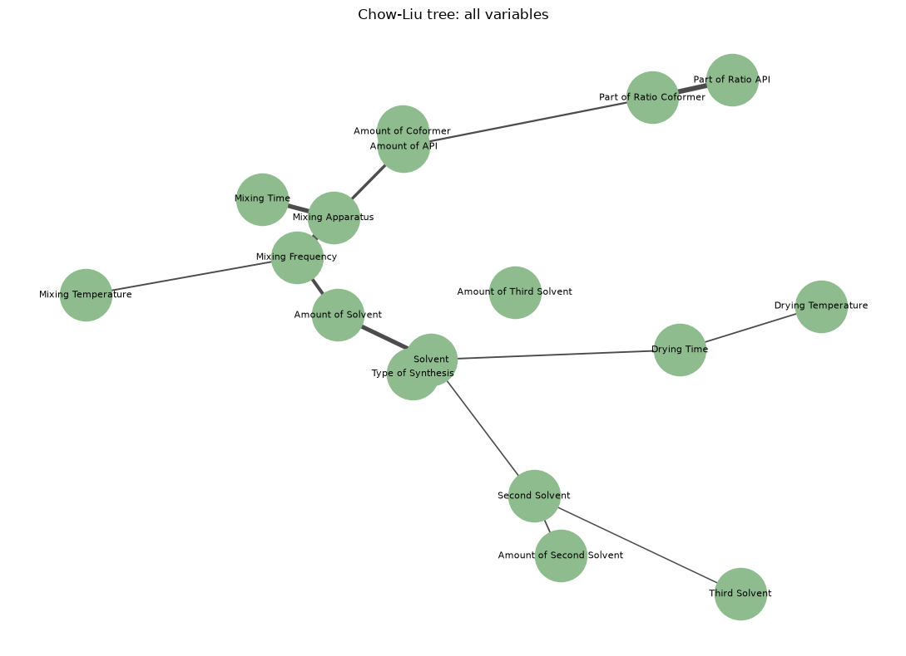
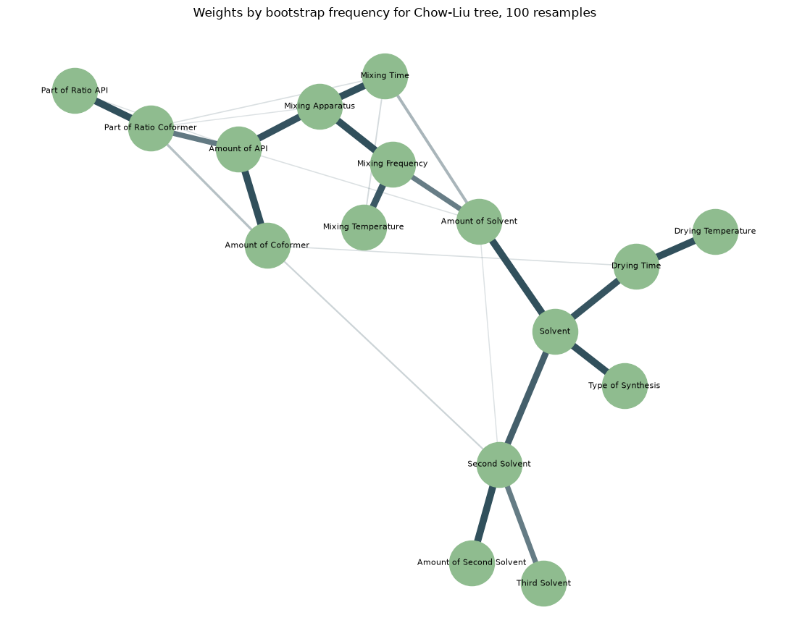
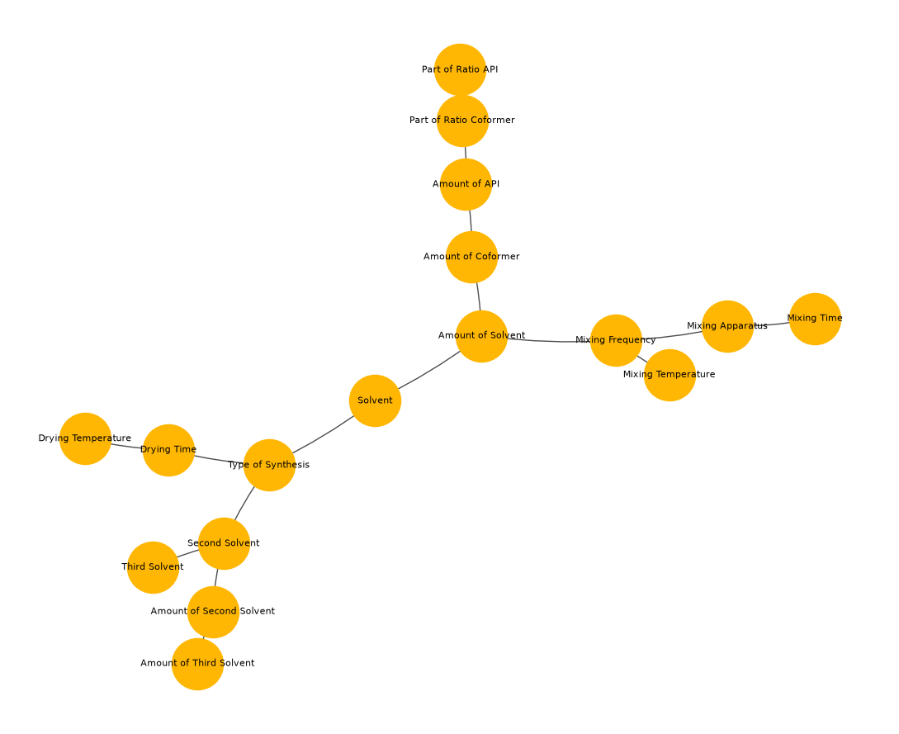
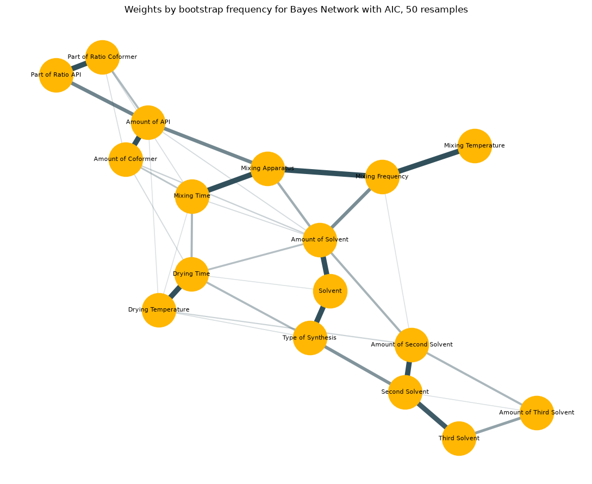
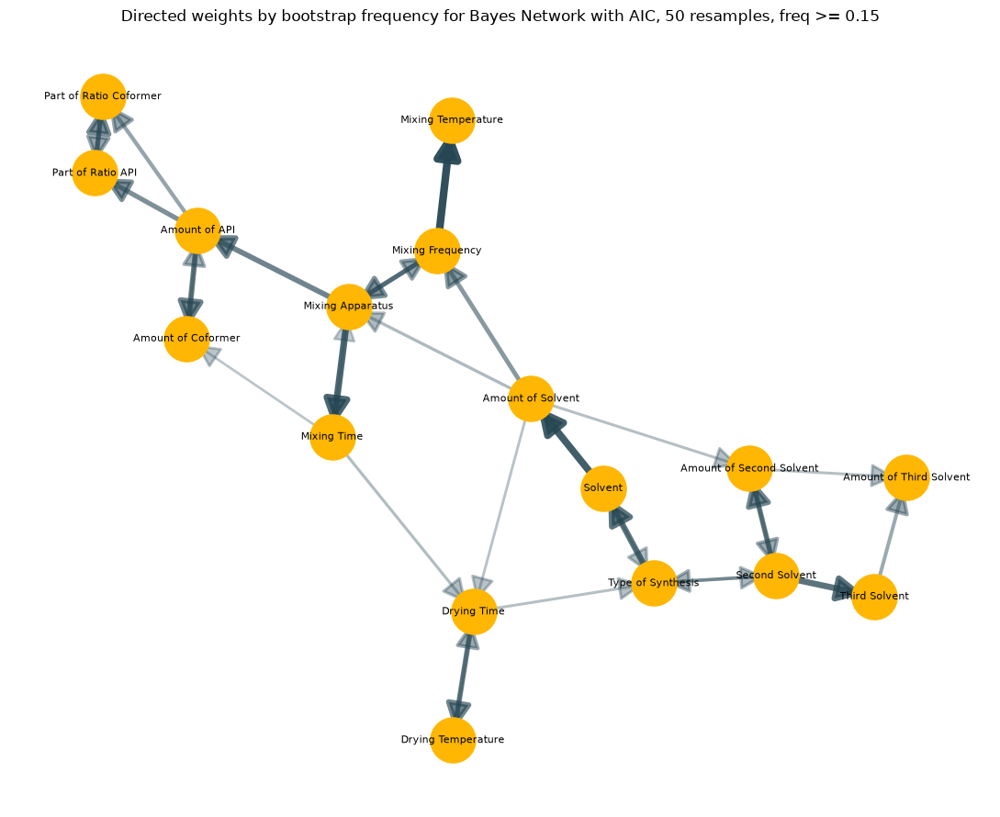
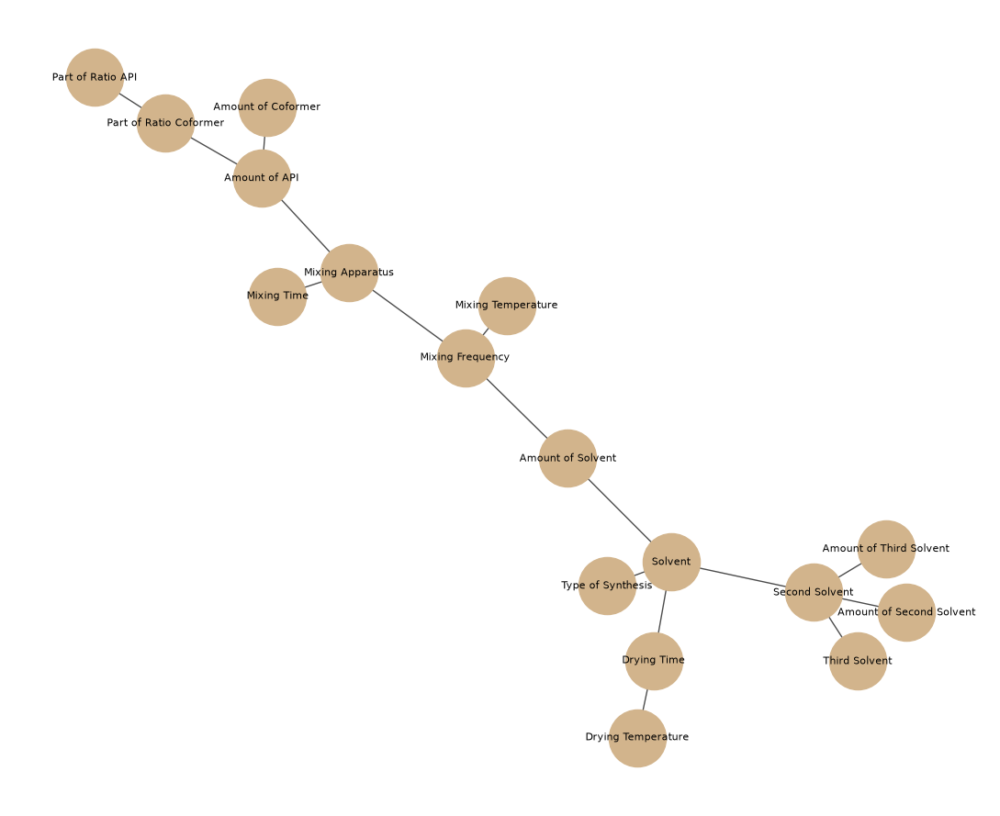
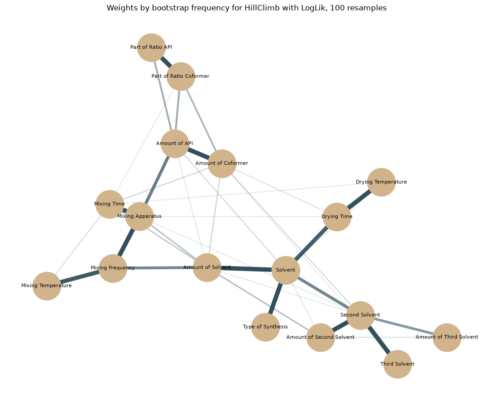
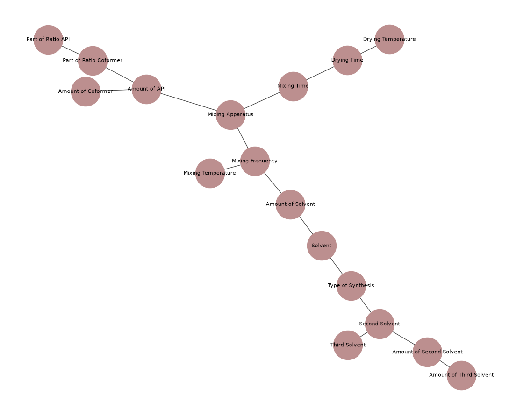
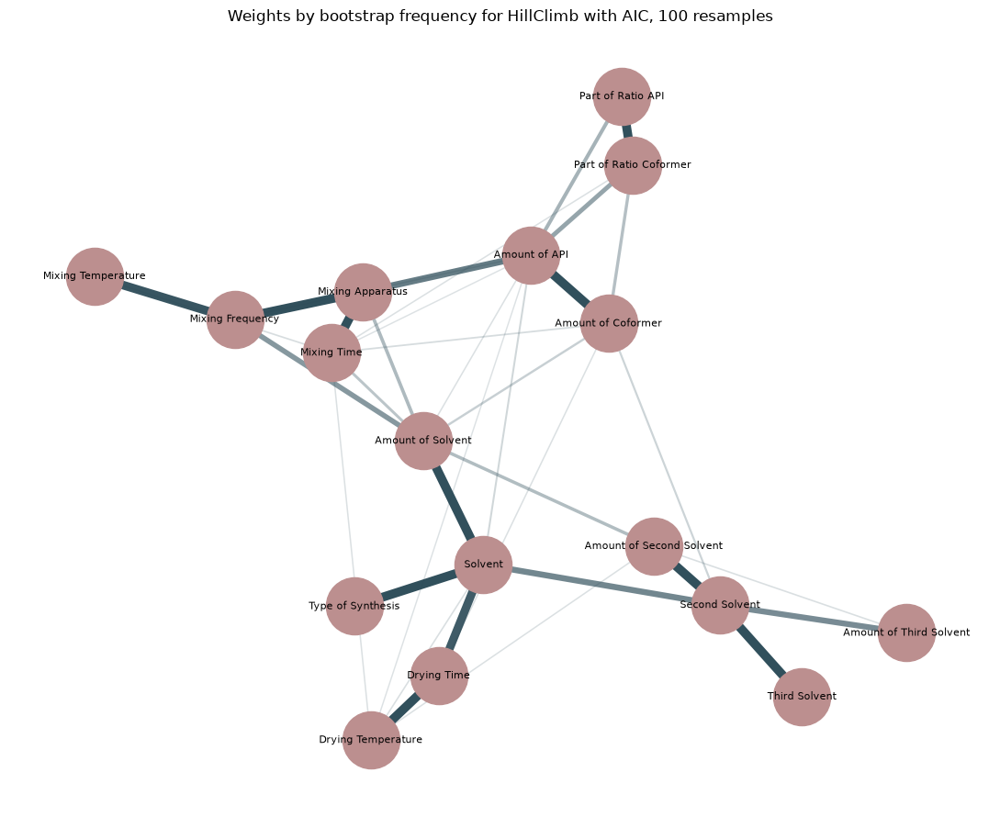

# Поиск структуры в данных о синтезе сокристаллов

Датасет `data/grinding.csv`:  записи об экспериментах по механохимическому синтезу сокристаллов (neat / liquid-assisted grinding), извлечённые из **562 статей** (**4058 записей** после парсинга, 30 сырых колонок).

## Задача
Цель — узнать, существует ли структура зависимостей, которая связывает параметры синтеза друг с другом, и можно ли выявить её надёжно, несмотря на разреженность данных.

В рамках эксперимента использовались различные графические вероятностные модели, поскольку они позволяют оценивать попарные зависимости на доступных парах наблюдений, не требуя полностью заполненных строк, и дают интерпретируемый граф связей между переменными.

## Структура репозитория

```
├── README.md
├── data/
│   ├── grinding.csv                 # сырой датасет
│   ├── grinding_clean.csv           # датасет после первичного парсинга
│   └── grinding_normalized.csv      # датасет после препроцессинга
├── notebooks/
│   ├── 01_data_preprocessing.ipynb  # парсинг, единицы измерения, заполненность, распределения
│   ├── 02_chow_liu.ipynb            # mutual information + Chow-Liu tree + bootstrap
│   ├── 03_bayes_networks.ipynb      # Bayes Network (BIC/AIC) + bootstrap (AIC)
│   └── 04_hillclimb_networks.ipynb  # HillClimbSearch (LL/BIC/AIC) + bootstrap (LL/AIC)
├── images/                          # графики с результатами
├── resources/                       # конфиги, словари с бинами и категориями
├── parsing.py                       # чтение сырого CSV и нормализация названий колонок
├── preprocessing_units.py           # парсинг чисел, конвертация единиц
├── preprocessing.py                 # маппинг категорий + биннинг числовых колонок
├── units.py                         # канонические единицы измерения, отчёт о размерностях
├── chow_liu.py                      # MutualInfo и ChowLiuTree
├── bayes_network.py                 # BayesNetwork (Greedy search на основе BIC/AIC)
└── bootstrap.py                     # NetworkBootstrap: устойчивость рёбер по ресэмплам
```

## Пайплайн

### 1. Парсинг и препроцессинг (`parsing.py`, `units.py`, `preprocessing_units.py`, `preprocessing.py`)

- **`parse_raw_csv`**: читает сырой CSV, отбрасывает служебную колонку `answer`, нормализует текстовые синонимы единиц измерения (`minutes`→`min`, `°C`→`c`, `Hz`→`hz` и т.д.)
- **`convert_numeric_to_float`**: парсит числовые значения, включая диапазоны вида `"10-20"` (берётся среднее)
- **`apply_fix_unit`**: приводит величины к канонической единице для каждой размерности (`ml`, `min`, `c`, `hz`), пересчитывая известные единицы и отбрасывая неконвертируемые
- **`unit_dimension_report`** (`units.py`): отчёт о том, какая доля сырых значений уже канонична, какая приводится тем же измерением, а какая требует внешних данных (например, `mol`→`mg`)
- **`Preprocessor`**: оркестрирует стадии — приведение единиц → маппинг категориальных колонок на канонические категории (`resources/categories.py`: типы синтеза, семейства растворителей, типы аппаратов) → биннинг числовых колонок по квантильным границам (`resources/auto_tolerance_bins.py`). На каждой стадии считается отчёт о потерях (`coverage_report`, `preprocessing_report`)

Результат — `data/grinding_normalized.csv`, содержащий категориальные и дискретизированные числовые колонки, пригодные для обучения сети. Стоит отметить, что нормализация не применялась для колонок с канонической единицей измерения `mg` (`Amount Unit`), поскольку такая нормализация требует дополнительной обработки датасета и извлечения данных о молярных массах веществ. Кроме того, приведение единиц измерения к каноническому `mg` приводит к появлению значительного числа выбросов и сильно смещает распределение колонок `Amount of API` и `Amount of Coformer` (которое, как можно увидеть в ноутбуке `notebooks/01_data_preprocessing.ipynb`, в рамках ненормализованного датасета является сравнительно стабильным)

### 2. Графические модели

Структура связей между 17 переменными (`VARIABLE_COLUMNS`) обучалась тремя независимыми методами — чтобы проверить, не является ли найденная структура артефактом конкретного алгоритма:

| Метод | Идея | Файл |
|---|---|---|
| **Chow-Liu tree** | Попарная mutual information между всеми переменными → максимальное остовное дерево | `chow_liu.py` |
| **Bayes Network** | Жадный локальный поиск: на каждом шаге добавляется/удаляется ребро, максимизирующее прирост информационного критерия BIC или AIC | `bayes_network.py` |
| **HillClimbSearch** | Жадный поиск структуры с критерием `ll-d` / `bic-d` / `aic-d`, использован как внешняя реализация из pgmpy | `notebooks/04_hillclimb_networks.ipynb` |

На практике модели с оптимизацией Байесовского информационного критерия (BIC) оказывались недообученными и давали плохо интерпретируемый граф, поэтому для формирования окончательных результатов использовалась оптимизация либо по информационному критерию Акаике (AIC) либо по логарифму правдоподобия (log-likelihood, LogLik).

### 3. Bootstrap-устойчивость (`bootstrap.py`)

`NetworkBootstrap` пересэмплирует датасет с возвращением (50–100 итераций) и каждый раз заново обучает структуру, позволяя увидеть частоту, с которой то или иное ребро встречается в ресэмплах.

## Результаты

Во всех трёх методах устойчиво воспроизводится один и тот же «скелет» графа, позволяющий выделить следующие цепочки из вершин:

1. **Состав пары**: `Part of Ratio Coformer ↔ Part of Ratio API ↔ Amount of API ↔ Amount of Coformer`
2. **Параметры измельчения**: `Mixing Time ↔ Mixing Apparatus ↔ Mixing Frequency ↔ Mixing Temperature`
3. **Растворитель и тип синтеза** — `Type of Synthesis ↔ Solvent ↔ Amount of Solvent`
4. **Сушка** — `Drying Time ↔ Drying Temperature`
5. **Другие растворители** — `Solvent ↔ Second Solvent ↔ Third Solvent`, `Second Solvent ↔ Amount of Second Solvent`

Согласованность результатов нескольких графических моделей позволяет предположить, что найденные цепочки отражают реальные зависимости в данных. Использованные методы также позволяют увидеть связи между различными цепочками (пусть даже они выражены не столь явно, как внутренние связи, и могут незначительно отличаться в зависимости от модели) и смоделировать полное дерево зависимостей.

### Модель Chow-liu tree

**Единичный фит:**



**Граф с весами по bootstrap-частоте:**



### Модель Bayes Network (AIC, max_parents=1)

**Единичный фит:**



**Граф с весами по bootstrap-частоте:**



**Направленный граф с весами по bootstrap-частоте:**



### Модель HillClimb (pgmpy, log-likelihood)

**Единичный фит:**



**Граф с весами по bootstrap-частоте:**



### Модель HillClimbSearch (pgmpy, AIC)

**Единичный фит:**



**Граф с весами по bootstrap-частоте:**



## Вывод

Несмотря на сильную разреженность датасета, графические  модели позволяют выявить устойчивую структуру зависимостей между параметрами синтеза. Три различных метода и как минимум два критерия (log-likelihood и AIC) воспроизводят одни и те же цепочки связей. Бутстрап-ресэмплинг подтверждает стабильность этих цепочек и позволяет тем или иным образом сформировать из них дерево зависимостей, которое можно использовать как основу в предсказательных моделях для параметров синтеза.